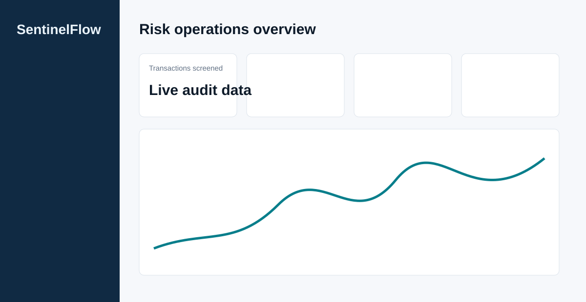
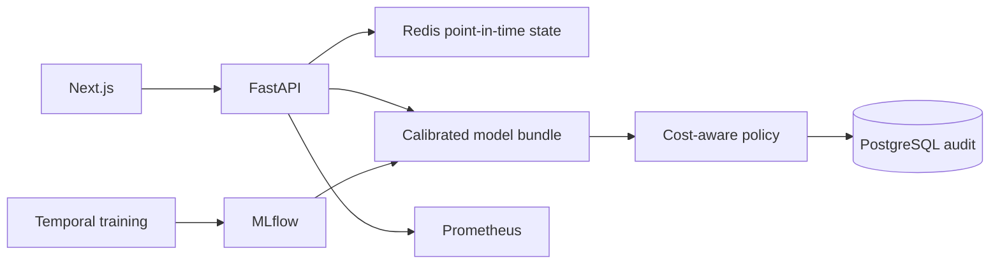

# SentinelFlow

**A real-time fraud-risk intelligence platform that combines strict point-in-time
behavioral features, calibrated ML, cost-aware decisions, and an auditable operations UI.**

> SentinelFlow is a production-oriented reference architecture for synthetic demo data.
> It is not a banking fraud model, a compliance-certified system, or a replacement for
> human review.

Maintained by Sneh.

[](https://vercel.com/new/clone?repository-url=https%3A%2F%2Fgithub.com%2FsnehOP9%2FSentinal-Flow&project-name=sentinelflow&root-directory=frontend)



## Why it exists

Many fraud ML projects stop at a random split and a notebook score. SentinelFlow instead
shows the difficult boundary between an offline fraud model and a real-time decision:
event-time correctness, calibration, constrained reviews, idempotency, velocity state,
auditable persistence, and a usable investigation interface.

## What is included

- FastAPI API with strict schemas, structured correlated errors, tenant-scoped
  repositories, capability authorization, idempotency keys/payload fingerprints,
  OpenAPI, `/health`, `/ready`, and Prometheus metrics.
- One shared feature definition for training and serving. It reads only events **strictly
  before** the current transaction, including at equal timestamps.
- Redis event-time sorted sets with namespaced keys, retention, exclusive timestamp reads,
  and Lua-backed idempotent customer/card state updates.
- SQLAlchemy 2.x audit persistence for PostgreSQL (and SQLite for isolated unit tests),
  integer-minor-unit money, tenant-scoped external transaction identities, transactional
  feature-state outbox, cases/review actions, API keys, and Alembic migrations.
- Reproducible synthetic generator; schema validation, data-quality fingerprint, temporal
  train → validation → untouched test split; five baseline models; calibration comparison;
  and MLflow tracking.
- Cost-aware validation threshold optimization for ALLOW / REVIEW / BLOCK, with an actual
  validation-artifact simulator in the Next.js UI.
- Local model-agnostic counterfactual contribution signals labelled as non-causal.
- Next.js/TypeScript dashboard, transaction explorer, review-case queue, investigation
  view, simulator, model governance, monitoring, and a same-origin demo-session UX.

## Architecture



See [architecture details](docs/ARCHITECTURE.md), including the inference sequence and
training pipeline diagrams.

## Quick start

The Docker image creates its **entirely fictional** demo dataset and trains its model while
building; no real payment data is bundled or required. Compose runs Alembic before the API.

```bash
git clone <your-fork-url>
cd fraud-detection-system
cp .env.example .env
docker compose up --build
```

Open [http://localhost:3000](http://localhost:3000). Backend docs: [http://localhost:8000/docs](http://localhost:8000/docs).
The browser does not choose a backend role directly. In the explicit demo configuration,
Next.js stores a labelled role in an HttpOnly session cookie and its same-origin proxy forwards
that role to the API. This remains demo-only. Production/staging configuration rejects demo
authentication and requires OIDC issuer, audience, and JWKS settings.

### Local Python development

```powershell
python -m venv .venv
.\.venv\Scripts\Activate.ps1
python -m pip install -e ".[dev,training]"
python scripts/generate_demo_transactions.py
python -m fraud_platform.training
$env:DATABASE_URL = "sqlite+aiosqlite:///./data/sentinelflow.db"
$env:REDIS_URL = ""
$env:PYTHONPATH = "backend/src"
uvicorn fraud_platform.main:app --reload
```

For a fully production-like local run use Compose: it supplies PostgreSQL and Redis. The
API falls back to a local SQLite/in-memory feature store only for isolated development and
tests. Compose runs `alembic upgrade head`; non-development configuration refuses
`create_all` at API startup.

## ML methodology

1. Validate required fields, amounts, timestamps, unique IDs, and binary labels; create a
   fingerprint that travels with model metadata.
2. Sort event-time groups and construct each row's features against strict historical
   state. Current/equal timestamp records are not available.
3. Split time consecutively: earliest 70% training, following 15% validation, latest 15%
   untouched test. Exact boundaries are emitted into `artifacts/production/metrics.json`.
4. Compare dummy prior, logistic regression, random forest, histogram gradient boosting,
   and LightGBM on validation PR-AUC. Calibrate the selected model with sigmoid and
   isotonic candidates using Brier score.
5. Optimize allow/block thresholds against explicit fraud loss, false-decline cost, review
   cost, review capture rate, and review capacity—not arbitrary constants.

Read [ML evaluation](docs/ML_EVALUATION.md) and the [model card](docs/MODEL_CARD.md).
Actual metrics are generated from the exact committed generator and exposed at
`GET /api/v1/model/metrics`; no hand-written model metrics are claimed here.

The committed default seed was also executed during this implementation: its synthetic
test result is PR-AUC **0.13988**, ROC-AUC **0.79417**, Brier **0.03208**, and recall at
1% FPR **0.07000**. See the reproducible result table in [ML evaluation](docs/ML_EVALUATION.md).

## API and product flow

```text
validate → read strictly-prior Redis events → build features → calibrated probability
→ policy decision → persist unique audit row → atomically append online state → response
```

`POST /api/v1/transactions/score` separates a tenant-scoped external transaction ID from an
optional scoped `Idempotency-Key`. A repeated key with the same canonical payload replays the
durable result; a changed payload returns a conflict. New REVIEW/BLOCK recommendations create
an advisory review case. The decision, case action, and Redis feature update all leave durable
audit/outbox evidence. Full request/response information is in [docs/API.md](docs/API.md) and
the generated [OpenAPI specification](docs/openapi.json).

## Testing, quality, and security

```bash
make test
make lint
docker compose up --build
```

The test suite includes unit data/feature/policy checks, temporal split checks, API
validation and persistence, idempotency conflicts, tenant-bound cases, scoped/revocable API
keys, online store behavior, and the required offline/online numeric parity test
(`tests/test_training_serving_parity.py`). CI runs
Ruff, Python tests, pip-audit (with one documented upstream MLflow-bound exception),
frontend lint/test/build, and both container builds.

## Measured local performance

On 2026-08-30, a 100-request sequential local score run against FastAPI with SQLite and
the generated model measured p50 **28.17 ms**, p95 **30.16 ms**, and p99 **36.39 ms**.
Run `python scripts/benchmark_api.py --requests 100 --concurrency 1` against a running API
to reproduce the workload. It is a local-demo result, not a throughput claim for a
production PostgreSQL/Redis deployment.

Security design and remaining production obligations are documented in
[SECURITY.md](SECURITY.md) and [docs/THREAT_MODEL.md](docs/THREAT_MODEL.md).

## Deployment

The recommended scale is a Next.js frontend plus one FastAPI container, managed PostgreSQL,
managed Redis, protected MLflow/artifacts, private networking, and a gateway identity
provider. Kubernetes is intentionally not required. See [deployment instructions](docs/DEPLOYMENT.md).

### Live Vercel demo

The public demo is deployed at [sentinalflow.vercel.app](https://sentinalflow.vercel.app),
with its FastAPI health endpoint at
[sentinalflow-api.vercel.app/api/v1/health](https://sentinalflow-api.vercel.app/api/v1/health).
The frontend production environment is configured with that API as
`SENTINELFLOW_API_ORIGIN`, so the dashboard, transaction simulator, cases, model, and
monitoring screens call the deployed service rather than displaying fabricated client data.

The deployment path initially exposed three configuration failures, all now resolved:

- Vercel could not auto-detect the nested FastAPI app, so the repository provides the
  supported root `api/index.py` application entrypoint.
- The frontend was first configured as a static site with `public` as its output folder;
  it now uses the Next.js preset with `frontend` as the root directory.
- The API bundle exceeded Vercel's function-size limit while training-only packages were
  installed. Those packages are now in the `training` optional dependency group, leaving
  the inference runtime in the deployed function.

This is a publicly accessible, **synthetic-data-only demo**. Its Vercel API uses the
development demo-auth profile and a SQLite database under `/tmp`; data can disappear when
the serverless runtime is replaced. Do not send payment data, credentials, or other
sensitive information, and do not treat it as a durable production service.

## Limitations and next steps

- The training data and labels are synthetic; evaluation does not establish real-world
  fraud performance, fairness, or operational safety.
- The outbox/retry state is implemented, but an independently deployed worker and
  reconciliation scheduler are still required for production recovery guarantees.
- Production OIDC configuration validation and API-key verification exist, but no identity
  provider, SAML/SCIM, RLS, or production gateway is provisioned here.
- The Vercel demo's database and online feature state are ephemeral. A production rollout
  needs managed PostgreSQL and Redis, production OIDC, private networking, and an
  independently deployed outbox worker.
- Read [known limitations](docs/KNOWN_LIMITATIONS.md), the [gap register](docs/GAP_REGISTER.md),
  [security architecture](docs/SECURITY_ARCHITECTURE.md), and [runbooks](docs/RUNBOOKS.md)
  before using this outside the synthetic demo.

## Attribution and license status

The current SentinelFlow implementation is available under the [MIT License](LICENSE).
Earlier source material is not covered by that grant; see [NOTICE.md](NOTICE.md).

The repository was cloned from an upstream repository that had no `LICENSE` at the audited
revision. See [NOTICE.md](NOTICE.md). No claim is made that upstream files are available
for proprietary reuse or relicensing; SentinelFlow’s new implementation is documented as a
clean implementation of the concepts.
