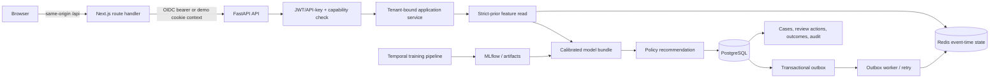
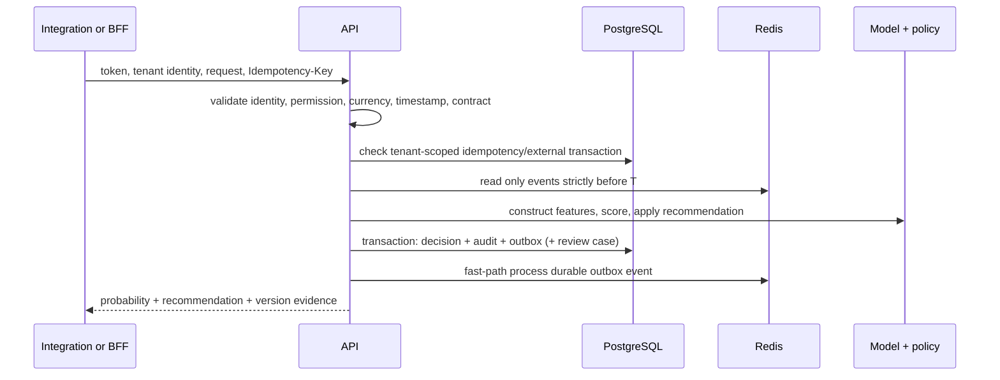

# Architecture

## Score sequence

Equal timestamps are concurrent and cannot observe one another. Out-of-order
events are scored against the state strictly available before their event time.
The present design uses bounded eventual state application through the outbox; it
does not yet serialize concurrent entities with Redis locks or a partitioned
stream. That trade-off is intentional and must be reconsidered for a customer
latency/ordering contract.

## Storage boundary

PostgreSQL is authoritative for decisions, idempotency records, tenant context,
cases, outcomes, API-key verifiers, audit events, and outbox state. Redis stores
derived event-time feature state. If Redis is unavailable, scoring fails visibly;
the service never claims that fabricated zero velocity context is a valid score.

## Deployment profile

Compose is a local synthetic demo topology: Next.js, FastAPI, PostgreSQL, Redis,
MLflow, and a one-shot Alembic migration service. It is not a staging deployment.
For a pilot, place OIDC/TLS/rate limiting at a gateway, use managed PostgreSQL and
Redis in private networking, run migrations and workers as separately observed
jobs, and add row-level security, backups, monitoring exporters, and customer
security controls.
